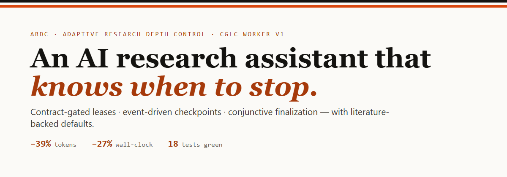
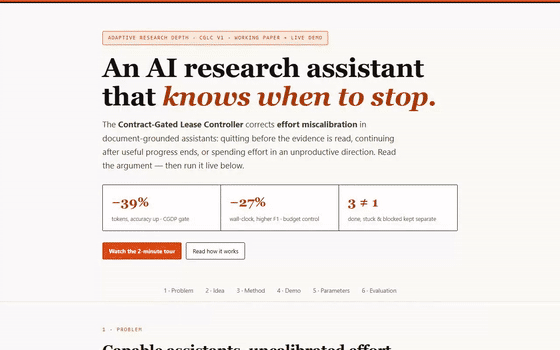
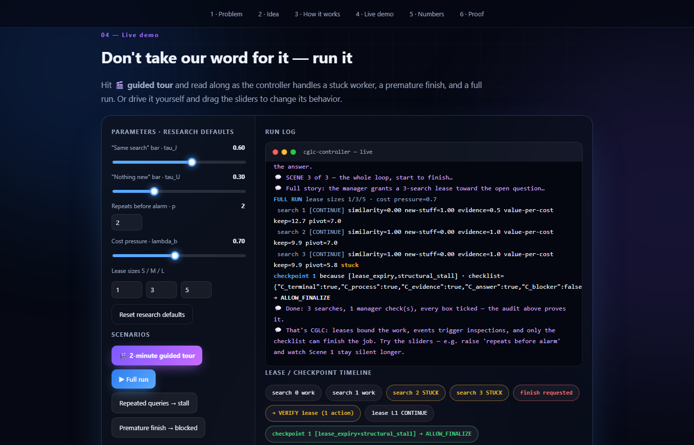
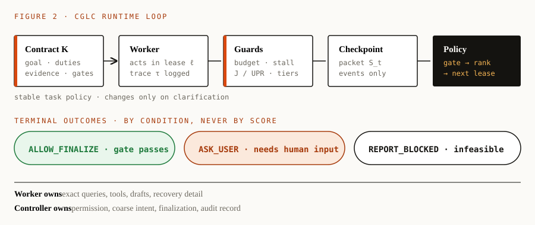

<p align="center">
  
  
  
  
  
  
</p>

<h1 align="center">ARDC — Adaptive Research Depth Control</h1>
<p align="center"><b>The Contract-Gated Lease Controller (Worker, v1)</b><br>
An external control layer that stops document agents from quitting early,
rambling on, or digging in the wrong direction.</p>

<p align="center">
  <a href="#demo">Live demo</a> ·
  <a href="ARCHITECTURE.md">Architecture</a> ·
  <a href="PARAMETERS.md">Parameters</a> ·
  <a href="ROADMAP.md">Roadmap</a>
</p>

> **Status.** Working implementation of the frozen baseline
> (*Adaptive_Research_Depth_Final_Architecture_Corrected.docx*, 27 Aug 2026).
> Architecture — contract / trace / checkpoint semantics / effort ranking / work
> leases / finalization authorization — is fixed. Thresholds, weights and
> coefficients are tunable configuration with literature-backed defaults.

## Contents

- [Demo](#demo) · [Problem](#1-problem) · [Method](#2-method) ·
  [Parameters](#3-parameters) · [Repository map](#4-repository-map) ·
  [Reproduction](#5-reproduction) · [Evaluation](#6-evaluation-and-falsification) ·
  [Scope](#7-scope-and-limitations) · [Sources](#8-primary-sources) · [License](#license)

## Demo



*Figure 1 — Guided tour of the live demo (`demo/index.html`): repeated queries trigger the
structural-stall checkpoint; a fluent but unsupported draft is denied finalization; a full
run terminates in `ALLOW_FINALIZE` with a complete audit record. Recorded in Chromium
(19 s, 1.3 MB); full-quality video: [`demo/demo-tour.mp4`](demo/demo-tour.mp4).*

Run it yourself — no backend, the full controller executes in the page:

- **Interactive explainer + console:** open `demo/index.html` (beginner-friendly:
  problem → idea → 5 steps → live console → parameters → falsification), press
  **Guided tour**, drag the sliders to change policy behavior.
- **Terminal version:** `python examples/demo_run.py` (stall trace, gate block, full
  audit trail).
- **Hosted:** `docs/index.html` is Pages-ready (repo Settings → Pages → `main`/`docs`).



## 1. Problem

Adaptive Research Depth addresses *effort miscalibration* in document-grounded work:

| # | Failure mode | Observable consequence |
|---|--------------|------------------------|
| 1 | Under-execution | Plausible answer before required reading, comparison, or verification |
| 2 | Unproductive continuation | Repeated actions / low-yield retrieval after sufficient work |
| 3 | Misdirected effort | Further budget in the same direction cannot close the relevant gap |

Fixed budgets, token caps, and generic "be thorough" prompts cannot distinguish
*completion* from *local stagnation* from *blocked termination*. CGLC makes that
distinction structural: the worker may propose completion but can never self-authorize it.

## 2. Method

**Runtime loop.** The worker executes inside a lease while the guard plane logs raw events
and costs. A semantic checkpoint fires only on mandatory events — finalization request,
lease expiry, `p`-round structural stall, blocker/contradiction, budget-tier crossing, or
maximum silence. At the checkpoint, the controller assembles the minimal semantic packet
`S_t = Φ(K, Δτ_t, L_{t−1}, draft_t, ℓ_t, budget_t)`, obtains a structured
receipt-cited judgment, and applies the deterministic decision order of §14.6:

1. Conjunctive gate passes → `ALLOW_FINALIZE`
2. User-only information needed → `ASK_USER`
3. Infeasible under access/budget → `REPORT_BLOCKED`
4. Otherwise rank feasible non-terminal actions by value-per-cost and issue the next lease;
   on non-positive utility fall back to `VERIFY` → `REDIRECT` → shortest safe lease.



**Normative equations (§14).** Retrieval novelty `UPR_t = |C_t ∖ H_{t−1}| / max(1, |C_t|)`;
action similarity `J_t` as windowed Jaccard maxima; `Stagnated_t` over `p` consecutive
rounds — a lease-ending inspection trigger, never a completion signal. Budget pressure
`ρ_t = 1 − min_j clip(b_jt/B_j, 0, 1)`; normalized cost `d_t(a)`; pressure
`Π_t(a) = λ_b·ρ_t·d_t(a)`. Operational score `u_t(a) = Δ̂_t(a) + Ψ_t(a) − Π_t(a)`,
`r_t(a) = max(0, u_t)/(d_t + ε)` — a ranking proxy among allowed non-terminal actions,
not a value-of-information claim and incapable of overriding any gate:

```
ALLOW_t = C_terminal ∧ C_process ∧ C_evidence ∧ C_answer ∧ ¬C_blocker
```

Exhaustion without a passing gate yields `REPORT_BLOCKED` (a transparent partial report),
never a labeled success. Every checkpoint emits a compact audit record (contract/lease
versions, trigger, receipt IDs, gate snapshot, selected and rejected decisions, remaining
budget, controller cost). Full design rationale: [`ARCHITECTURE.md`](ARCHITECTURE.md).

## 3. Parameters

Defaults are extracted from their originating papers — starting points, not optima —
and must be ablated on held-out trajectories. Full provenance in [`PARAMETERS.md`](PARAMETERS.md);
runnable values in [`configs/default.yaml`](configs/default.yaml).

| Component | Symbols | Default | Origin |
|---|---|---|---|
| Stagnation gate | `τ_J, τ_U, p` | `0.6, 0.3, 2` | CGDP (`f_j0.6_u0.3_p2`) |
| Action utility | `λ_b, λ_decomp, λ_early` | `0.7, 0.14, 0.18` | Inference-Time Budget Control |
| Resource weights / smoothing | `ω_j, ε` | equal, `1e−5` | same |
| HALT stopping | `τ, ε, policy` | `0.0, 0.02, ALL_MATCH` | HALT |
| Coverage (ablation) | `θ_e, θ_ev, δ, r_max` | `0.85, 0.70, 0.05, 7` | MAP-Law |
| Continuation (deferred) | `λ decay, T` | `1.0→0.1, 10` | Stop-RAG |
| Observation filter | `τ_len, τ_step, τ_loop` | `3000, 4–8, 3–5` | SupervisorAgent |
| Execution temperature | `T_gen, T_select` | `0.7, 0.0` | BATS |
| Leases | SHORT / STANDARD / EXTENDED | `1 / 3 / 5` | project convention |

## 4. Repository map

```
src/cglc/
  config.py        all parameter groups + budget tiers (literature defaults)
  contracts.py     task contract K (goal, duties, obligations, schema, blockers)
  trace.py         append-only raw trace + budget accounting
  ledger.py        bounded evidence ledger (support s_it, contradiction c_it)
  stagnation.py    UPR_t, J_t, Stagnated_t
  budget.py        rho_t, d_t(a), Pi_t(a)
  scoring.py       Delta_hat, Psi, u_t, r_t
  gates.py         conjunctive finalization gate (+ HALT / coverage helpers)
  leases.py        SHORT/STANDARD/EXTENDED + guard-plane screens
  guards.py        deterministic guards + checkpoint scheduler
  controller.py    decision order (§14.6) + fallback
  runner.py        event-driven Fig. 2 loop (pluggable LLM judge)
  audit.py         decision records (§7.5)
  worker/          DocumentWorker interface, FixedCorpusWorker, LLMDocumentWorker (whole doc),
                   RAGDocumentWorker (retrieval), ExtractiveWorker (offline), WorkerAdapter
  llm.py           bring-your-own-key Claude client + JSON helpers + provider factory
  llm_groq.py      Groq client: any Groq chat model, stdlib only, schema-validated JSON
  judge.py         LLM checkpoint judge (cited receipts, fail-closed)
  retrieval.py     dependency-free BM25 over chunks (RAG mode)
  service.py       request -> run -> JSON for the web demo (validation, caps, key scrubbing)
  web.py           local server: demo site + API (python -m cglc.web)
  evaluate/        Table-16 metrics + §11.1 ablation list
  bench/           benchmark harness: dataset adapters, contract regimes, the 9 arms, report
demo/              site: explainer, "Try it" (try.js/try.css), simulator, GIF, MP4
app.py             Vercel entrypoint (Flask API); public/ is the deployed site
vercel.json        60 s function limit + headers
docs/              Pages-ready demo copy + architecture figure
configs/           default.yaml (runnable literature defaults)
examples/          quickstart.py (offline), llm_quickstart.py (real LLM), comparison_task.json, demo_run.py
tests/             unit/integration tests (LLM paths use scripted fakes)
```

## 5. Reproduction

```bash
pip install -e ".[dev]"
pytest -q                        # stagnation, budget, scoring, gates, controller, runner, LLM/Groq/RAG/service
python examples/quickstart.py    # minimal controlled comparison run
python examples/demo_run.py      # narrated terminal demo: stall, gate block, full run w/ audit
```

### Real LLM mode (bring your own key)

`quickstart.py` and `demo_run.py` are **offline**: a TF-IDF worker and a rule-based judge, no
network, no key. They prove the control logic, not answer quality. For a real run:

```bash
pip install -e ".[llm]"
export ANTHROPIC_API_KEY=...          # PowerShell: $env:ANTHROPIC_API_KEY="..."
python examples/llm_quickstart.py     # billed API calls
```

- **Key**: read from your environment by the Anthropic SDK (or `AnthropicClient(api_key=...)`).
  Never stored, logged, or put in a config file.
- **Model**: `claude-opus-5-5` by default; override with `CGLC_MODEL` (e.g. `claude-sonnet-5-5`
  for a cheaper run).
- **`LLMDocumentWorker`** does the research: it reads the corpus and cites verbatim quotes. Quotes
  not found in the named document are dropped, so receipts can only point at real text.
- **`LLMJudge`** is the checkpoint judge: a SUPPORTED claim needs a valid cited span, and any judge
  failure keeps the finalization gate closed. Use `Runner(judge=..., harvest_receipts=False)`.
- **Spend**: worker and judge token usage are charged to the real budget (`limits.tokens`);
  cached-prefix reads are not.
- **Sampling**: current Claude models reject `temperature`, so BATS `T_gen`/`T_select` stay in the
  logged config but are not sent.
- **Refusal fallbacks** (`AnthropicClient(fallbacks=True)`) are off by default and untested against
  the live API.

To use another provider, implement `LLMClient.complete_json` (see `llm.py`).

### Groq (any model) and your own documents (RAG)

```bash
export GROQ_API_KEY=...                       # PowerShell: $env:GROQ_API_KEY="..."
python -m cglc.web                            # http://127.0.0.1:8000, then "Try it"
```

The **Try it** section of the site takes any pasted/uploaded text or PDF, a question, and the
**contract** (what must be proven; per the design the contract comes from the user in V1, so the box
is pre-filled with a generic requirement that you can edit, and every result states who wrote the
contract), then shows the verdict, the five gates, cited evidence, a
step-by-step timeline and the spend. Pick **Groq** (load your key's model list or type any model id),
**Claude**, or **Offline** (no key, no AI; mechanics only). Small inputs go into the prompt whole;
large ones switch to retrieval (BM25 top passages) automatically. Groq works in `json_object` mode on
every model; the reply is schema-validated with one repair retry, and anything invalid fails closed.

### The contract as JSON

The contract is the tuple `K = (g, H_proc, H_evid, S_soft, B_mat, A_schema, B_policy)`. Per the design, in
version 1 it is supplied by the user (or the benchmark); the controller never invents it. The site's
"Contract as JSON" mode and the API field `contract` take the whole tuple:

```json
{
  "goal": "How is revenue split, and which provider do advertisers use?",
  "process_duties": [{"check": "cite_document", "document": "report.pdf"}],
  "evidence_obligations": [
    {"obligation_id": "split", "proposition": "The revenue split is stated in a quote."},
    {"proposition": "The funding provider is named in a quote.", "required_receipts": 2}
  ],
  "soft_prefs": {"style": "two short sentences"},
  "blockers": ["the document does not describe revenue at all"],
  "answer_schema": {"format": "Two short sentences, each followed by the document name in brackets."},
  "budget_policy": {"max_tool_calls": 8, "max_tokens": 40000, "max_seconds": 120}
}
```

What each field does in this version (the result also prints this list for the contract you sent):

| Field | Effect |
|---|---|
| `goal` (g) | the question; used by worker and judge |
| `process_duties` (H_proc) | hard duties **checked by code**: `use_every_document`, `cite_document` (+`document`), `min_distinct_sources` (+`n`). Free text is rejected because nothing could verify it |
| `evidence_obligations` (H_evid) | what must be proven; `required_receipts` = distinct supporting quotes needed |
| `soft_prefs` (S_soft) | shown to the worker as preferences, **not enforced** |
| `blockers` (B_mat) | conditions the judge watches for (a model judgement, not a code check) |
| `answer_schema` (A_schema) | required answer form, shown to worker and judge |
| `budget_policy` (B_policy) | `max_tool_calls` / `max_tokens` / `max_seconds` set the run limits (capped by the server); other keys are recorded only |

Unknown fields, wrong types and impossible duties are rejected with a message. The server sets the
provenance (`user-supplied (JSON contract)`); it is never taken from the input. The simple form compiles
to the same structure.

#### Importing `cglc-contract-v1` contracts (e.g. WebRider)

A contract with `"contract_schema": "cglc-contract-v1"` is read by a second, equally strict parser
(`src/cglc/contract_import.py`). That format describes a **web-browsing** task; this project is
document-grounded, so the mapping is explicit and nothing is pretended:

| In the file | Becomes |
|---|---|
| `goal` | `goal` |
| `evidence_obligations` | evidence obligations (`Quoted evidence for: ...`); wording like "when relevant" / "if visible" makes the obligation *conditional* (the judge may mark it not applicable) |
| `hard_task_constraints` | "must show / be / address / use / distinguish ..." become evidence obligations (each needs a quote); the rest ("must not ...", "must avoid ...", "must remain ...") become **conduct rules** |
| `process_duties` (text) | **conduct rules**: shown to the worker and the judge, reported as *not machine-checked* (no code can verify "browse only" in a document run) |
| `soft_preferences` | `soft_prefs` (shown to the worker, not enforced) |
| `blockers` | `blockers` (watched by the judge) |
| `answer_schema` (text) | `answer_schema` |
| `budget_policy` | `runtime_budget_caps` become run limits (the server caps them); `structural_stall_parameters` and `lease_action_caps` are applied to the controller; other keys are recorded only |
| `provenance`, `revision_id` | recorded in the provenance string as a *claim* by the input (the hash is not verified) |

The site's "Contract as JSON" mode has a **Load a contract file** button; a file holding a list shows a
picker. From the command line: `python examples/run_contract_file.py contracts.json <contract_id>
doc1.txt doc2.txt` (bring your own key). The browsing itself is not done by this project: you supply the
documents (for instance saved pages) that the contract's evidence must come from.

### Deploy (Vercel)

`app.py` is a small Flask app (the API: `/api/run`, `/api/models`, `/api/health`); the demo site is
served from `public/` by Vercel's CDN. Import the repo in Vercel (framework is auto-detected as Flask,
no build command), or run `vercel deploy`. `vercel.json` sets a 60 s function limit. Keys are sent per
request over HTTPS, used for that run only, never stored or logged; hosted runs are capped (depth
presets, a 240 s time limit that you can change with `CGLC_TIME_LIMIT`, 600k characters). Vercel's Hobby
plan allows 300 s per function with Fluid compute (default for new projects); without Fluid compute set
`CGLC_TIME_LIMIT=50` and `maxDuration` 60.

`demo/` is the canonical copy of the site. After editing it run `python scripts/sync_site.py` to refresh
`docs/` (GitHub Pages) and `public/` (Vercel); a test fails if they drift.

### Benchmark harness (no results yet)

`python -m cglc.bench.run` wraps HotpotQA / 2Wiki / MuSiQue items as contracts and runs the §11.1
ladder; `python -m cglc.bench.report` prints the paired table with bootstrap CIs. The protocol,
metrics and falsification criteria are frozen in [BENCHMARK.md](BENCHMARK.md) before any run. The
harness never downloads data and spends nothing without `--yes`; `--estimate` prints the cost first.
The measured results table does not exist yet; the defaults remain literature-backed, not measured.

## 6. Evaluation and falsification

Minimum ladder (§11.1): uncontrolled worker → fixed-shallow / fixed-deep → generic prompt →
fixed checkpoints → CGLC∖stall → CGLC∖scoring → **full CGLC** (+ optional always-on judge
as overhead upper bound). Dimensions (Table 16): outcome quality, process compliance,
grounding, behavior, user time, system cost, controller errors, calibration. The project
fails if a prompt/fixed budget matches it, overhead consumes savings, premature answers
rise, redirects never beat same-direction budget, gains vanish off-distribution, or the
ledger duplicates worker effort. What to build next, in order: [`ROADMAP.md`](ROADMAP.md).

## 7. Scope and limitations

Version 1 covers fixed-corpus comparison, document QA, and specification audit with
benchmark/user-confirmed contracts and no training. Deferred: automatic obligation
extraction, learned continuation values and lease sizing, calibrated false-allow control,
open-web scope, and controller-generated exact plans (explicitly out of scope —
that would make the controller a second research agent). No claim is made of globally
optimal stopping or global evidence exhaustion; gates are contract-relative, and stagnation
signals local stall only.

## 8. Primary sources

WebRider (intent contract, ledger, gated success) · CGDP/PBAI (bounded memory, stagnation
trigger) · Inference-Time Budget Control (feasible ranking, value-per-cost) · HALT
(external evidence-relative stopping) · Stop-RAG (forward continuation value) · MAP-Law
(requirements, gain, direction) · SupervisorAgent (cheap screening) · ECT (authorization
vs proposal) · BATS (budget tracking, continue/pivot) · S2G-RAG (upper-bound judge) ·
RaM (value-of-computation objective). Paper-specific figures cited are author-reported;
the synthesis remains a hypothesis pending the evaluation above.

## License

MIT — see [LICENSE](LICENSE).
